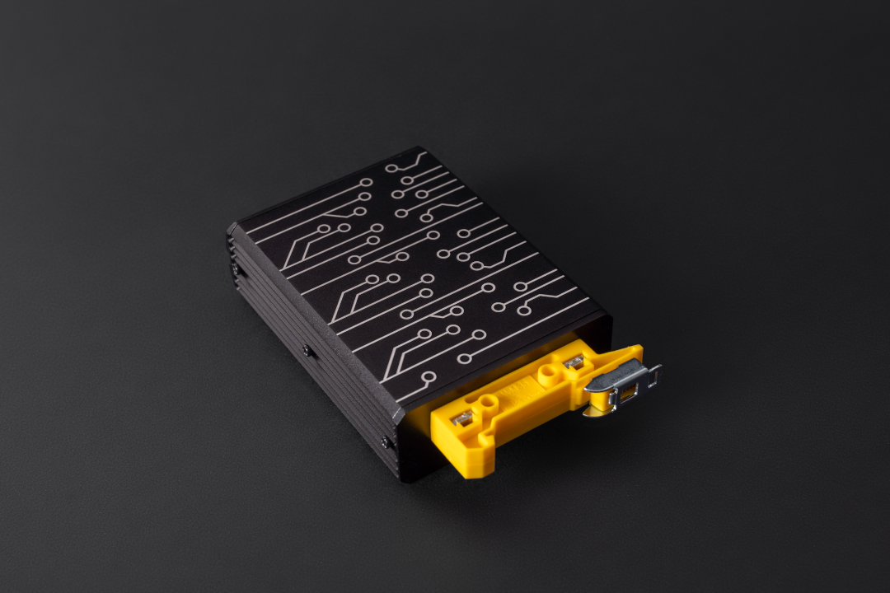
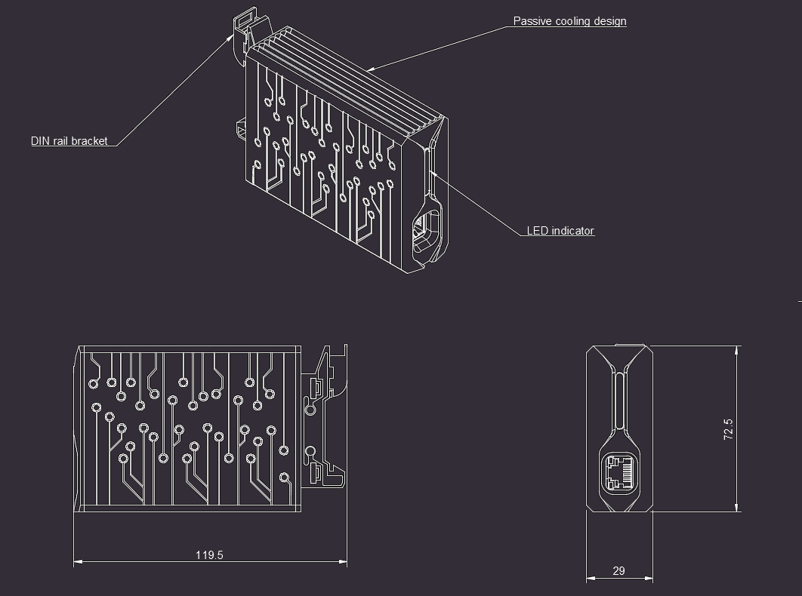
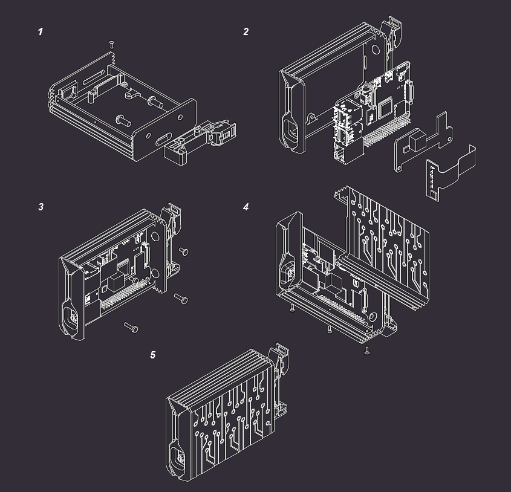

=========================
Scalenode RPi 4 enclosure
=========================

Copyright (c) 2022 `Antmicro <https://www.antmicro.com>`_

Overview
--------

This repository contains open hardware design files of the Raspberry Pi 4 cluster enclosure.

It is designed to be a modular and stackable solution for an ARM cluster based on Raspberry Pi 4B. 
The design files are provided in a STEP file format.
The geometry of the metal body of the enclosure allows for machining with most of the CNC prototyping services.
The enclosure includes a translucent 3D-printable light guide which was optimized for SLA printing with translucent resins.

Repository structure
--------------------
The main repository directory contains 3D models of the enclosure assembly, a LICENSE and README.
The remaining files are stored in the following directories:

* ``pts`` - contains the project parts in separate files
* ``img`` - contains graphics for this README
* ``dwg`` - contains mechanical drawings
* ``csv`` - contains BOM

Key features
------------
* Passive cooling design
* DIN rail mount
* RGB LED indicator
* Modular and stackable
* 2U in a 19" rack cabinet
* Up to 56 units fit on a single floor of the rack cabinet

Mechanical outline
------------------

The enclosure provides passive cooling and was designed in a stackable form on a TH35 (DIN) rail.
There are multiple off-the-shelf DIN rail panel brackets available for 19" rack cabinets. 
The enclosure occupies 2U while installed in a rack cabinet.
Below there is a mechanical overview provided with outline dimensions provided in millimeters.

Assembly instructions
---------------------

A basic BOM is provided as a separate `CSV file <csv/rpi-enclosure-bom.csv>`_ to aid the component sourcing.
The assembly instructions below refer to the parts from that BOM.
The assembly includes a custom `RPi LED Flex PCB <https://github.com/antmicro/rpi-led-flex-board>`_ which has been released as an Open Source Hardware project in a separate repository.

#. Insert the 3D-printed RPi LED lightguide into the main case and fasten the bolt
   
   * Mount the WM-35 din clip with two bolts

#. Insert RPi LED indicator into the lightguide

   * Mount the UCTRONICS (`UC U6109 <https://www.uctronics.com/poe-hat-for-raspberry-pi-4-uctronics-mini-power-over-ethernet-expansion-board-for-raspberry-pi-4-b-3-b.html>`_) PoE hat on the Raspberry PI and put it in the main case
   * Insert FFC of the LED indicator into the camera connector (J3) located on the Raspberry Pi

#. Fasten Raspberry Pi and the PoE hat using M2.5 bolts

   * Apply some thermal paste to the processor and the DC/DC regulator on the PoE Hat

#. Put the cover on and press it down so that the paste evenly covers the surface of the ICs

   * Place the bolts in the holes on the bottom of the housing and tighten them gently
   
#. Insert an SD card to the Raspberry using a slot located under the DIN clip

#. Attach Ethernet cable connected to a PoE switch/injector and check if the RPi boots

License
=======

`Apache-2.0 <LICENSE>`_
