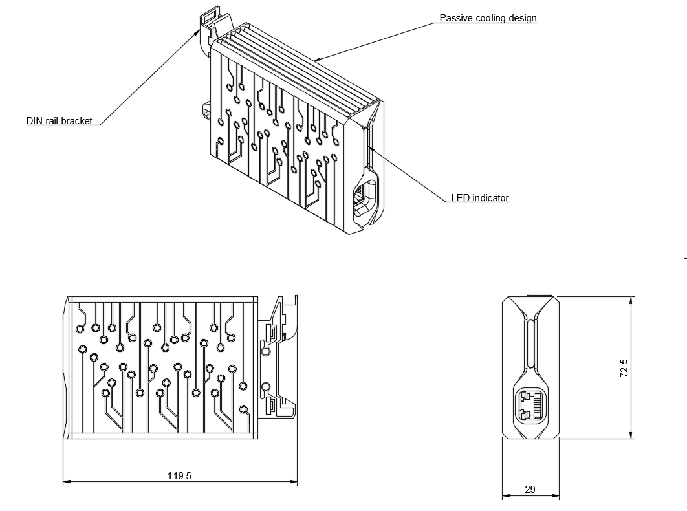

==============================
Raspberry Pi cluster enclosure
==============================

Copyright (c) 2022 `Antmicro <https://www.antmicro.com>`_

Overview
--------

This repository contains open hardware design files of the Antmicro's Raspberry Pi cluster enclosure.
It is designed to be a modular and stackable solution for KVM cluster based on Raspberry Pi 4B.
The enclosure provides passive cooling, device status indication and it fits the 1U of a server rack.
The design files are in step file extension.

Repository structure
--------------------
The main repository directory contains 3D models of the enclosure assembly, a LICENSE and README.
The remaining files are stored in the following directories:

* ``pts`` - contains the project parts in separate files
* ``img`` - contains graphics for this README
* ``dwg`` - contains mechanical drawings

Key Features
------------
* Passive cooling design
* DIN rail mount bracket
* RGB LED indicator
* Modular and stackable
* 1U of a 19" rack cabbinet fits up to 56 units

License
=======

`Apache-2.0 <LICENSE>`_

