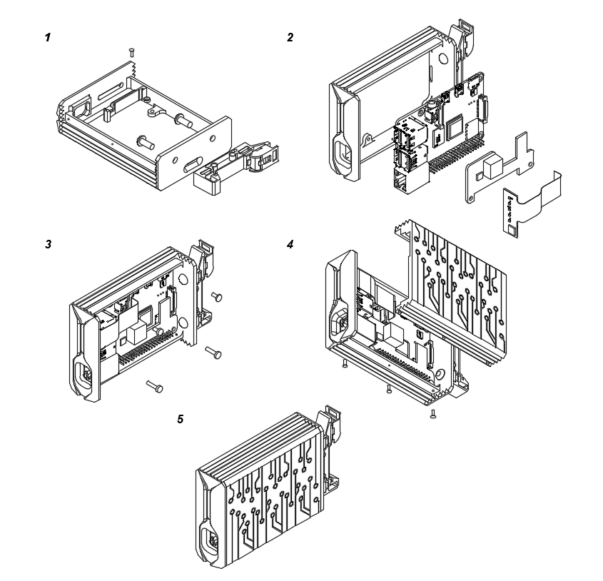

==============================
Raspberry Pi cluster enclosure
==============================

Copyright (c) 2022 `Antmicro <https://www.antmicro.com>`_

Overview
--------

This repository contains open hardware design files of the Antmicro's Raspberry Pi cluster enclosure.
It is designed to be a modular and stackable solution for KVM cluster based on Raspberry Pi 4B.
The enclosure provides passive cooling, device status indication and it fits the 1U of a server rack.
The design files are in step file extension.

.. figure:: img/drawing.png
   :width: 70%

Repository structure
--------------------
The main repository directory contains 3D models of the enclosure assembly, a LICENSE and README.
The remaining files are stored in the following directories:

* ``pts`` - contains the project parts in separate files
* ``img`` - contains graphics for this README
* ``dwg`` - contains mechanical drawings

Key Features
------------
* Passive cooling design
* DIN rail mount bracket
* RGB LED indicator
* Modular and stackable
* 1U of a 19" rack cabbinet fits up to 56 units

Bill of materials
-----------------
Following tabele contains all necessary components to build a single cluster node.

+-------+------------------------------------+---------------+
| Item  | Description                        | Qty per unit  |
+=======+====================================+===============+
| 1     | RPi Enclosure                      | 1             |
+-------+------------------------------------+---------------+
| 2     | RPi LED lightguide                 | 1             |
+-------+------------------------------------+---------------+
| 3     | RPi LED Indicator                  | 1             |
+-------+------------------------------------+---------------+
| 4     | Raspberry Pi 4 B 8GB RAM 1.5GHz    | 1             |
+-------+------------------------------------+---------------+
| 5     | PoE Hat UCTRONICS U6109            | 1             |
+-------+------------------------------------+---------------+
| 6     | WM-35 DIN clip                     | 1             |
+-------+------------------------------------+---------------+
| 7     | Enclosure fastening bolts(M1.6x5)  | 3             |
+-------+------------------------------------+---------------+
| 8     | Lightguide fastening bolt (M1.6x5) | 1             |
+-------+------------------------------------+---------------+
| 9     | Poe Hat fastening bolts (M2.5x5)   | 2             |
+-------+------------------------------------+---------------+
| 10    | RPi fastening bolts (M2.5x5)       | 2             |
+-------+------------------------------------+---------------+
| 11    | DIN clip fastening bolts (M4x10)   | 2             |
+-------+------------------------------------+---------------+
| 12    | PoE Hat standoff (2.7x03)          | 2             |
+-------+------------------------------------+---------------+
| 13    | Thermal paste                      | 1g            |
+-------+------------------------------------+---------------+

Assembly instructions
---------------------

1. Insert the RPi LED lightguide into the main case and fasten the bolt
   
   - Mount WM-35 din clip with two bolts

2. Insert RPi LED indicator into the loghtguide

   - Mount PoE hat on the Raspberry PI and put it in the main case
   - Insert FFC of the LED indicator into Raspberry Pi camera connector

3. Fasten Raspberry and the PoE hat using M2.5 bolts

   - Apply the thermal paste to the processor and the IC on PoE Hat

4. Put the cover on and press it down so that the paste evenly covers the surface of the processor and the IC

   - Place the bolts in the holes on the bottom of the housing and tighten them gently.

License
=======

`Apache-2.0 <LICENSE>`_

